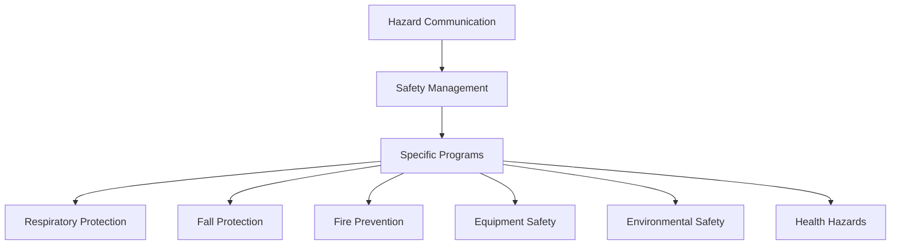

# Safety Manual Section Map

## Major Sections Overview

1. **Hazard Communication** [Section ID: HAZ-COM]
   - Policy
   - Program
   - Container Labeling
   - Safety Data Sheets
   - Training Requirements

2. **Safety Management** [Section ID: SAF-MGT]
   - Leadership
   - Worker Participation
   - Hazard Assessment
   - Prevention and Control
   - Training
   - Program Evaluation

3. **Respiratory Protection** [Section ID: RESP-PROT]
   - Program Administration
   - Medical Evaluation
   - Equipment Selection
   - Fit Testing
   - Maintenance

4. **Fall Protection** [Section ID: FALL-PROT]
   - Job Information
   - Hazard Assessment
   - Protection Methods
   - Equipment Care
   - Emergency Procedures

5. **Fire Prevention** [Section ID: FIRE-PREV]
   - Policy
   - Administration
   - Hazard Types
   - Prevention Measures
   - Emergency Response

6. **Equipment Safety** [Section ID: EQUIP-SAF]
   - Power Tools
   - Industrial Trucks
   - Maintenance
   - Training
   - Inspections

7. **Environmental Safety** [Section ID: ENV-SAF]
   - Spill Prevention
   - Response Planning
   - Hazardous Materials
   - Disposal Procedures

8. **Health Hazards** [Section ID: HLTH-HAZ]
   - Asbestos/Lead
   - Bloodborne Pathogens
   - Communicable Disease
   - Exposure Control

## Context Relationships

### Primary Dependencies


### Cross-References
- Hazard Communication ↔ All Sections
- Safety Management ↔ Program Administration
- Equipment Safety ↔ Fall Protection
- Environmental Safety ↔ Health Hazards

## Processing Order
1. Hazard Communication
2. Safety Management
3. Respiratory Protection
4. Fall Protection
5. Fire Prevention
6. Equipment Safety
7. Environmental Safety
8. Health Hazards

## AI Context Windows
Each section should be processed with:
- Previous section summary
- Next section overview
- Related cross-references
- Regulatory requirements
- Company-specific modifications

## Website Structure
```
/
├── index.html
├── hazard-communication/
│   ├── policy/
│   ├── program/
│   └── training/
├── safety-management/
│   ├── leadership/
│   ├── participation/
│   └── assessment/
└── [other-sections]/
```

## AI Assistant Integration Points
Each page should include:
1. Section-specific context
2. Relevant regulations
3. Common questions
4. Implementation guidance
5. Cross-reference awareness